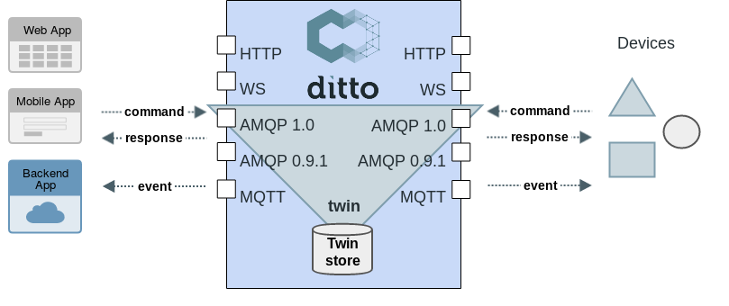
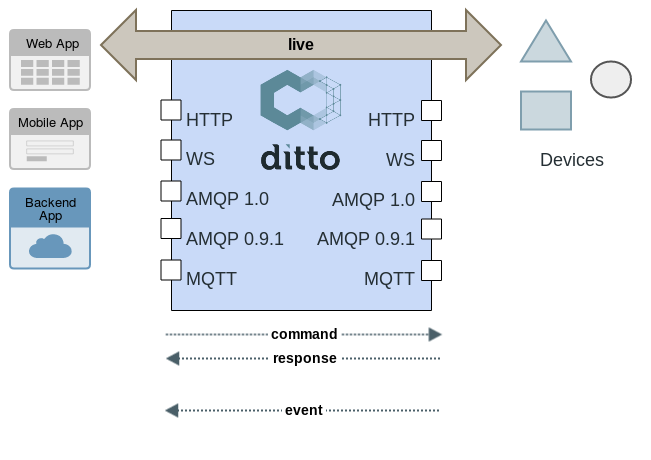

# Protocol twin/live channel

The Ditto Protocol supports two communication channels that address different aspects of devices and their digital twins.

> **TL;DR**: Use the **twin** channel to read/write the server-side digital twin. Use the **live** channel to communicate directly with the actual device. Policy commands use neither channel.

## Overview

When you send a protocol message, the channel determines where Ditto routes it:

- **Twin channel**: interacts with the digital twin stored in Ditto
- **Live channel**: routes the message to the actual device

Both channels enforce [authorization](basic-auth.html). Ditto checks permissions before processing or forwarding any message.

## Twin channel

The **twin** channel connects to the server-side digital representation of a Thing. You read and update this stored state through the twin channel.

*Ditto twin channel pattern*

Use the twin channel when you want to:

- Read the last known state of a device without waking it up
- Update the digital twin's attributes or features
- Search across all twins

The twin may be slightly behind the physical device (e.g., a sleeping sensor), but you avoid round-trips to the device itself.

## Live channel

The **live** channel routes commands and messages directly to a connected device (or a gateway that connects to it). The device itself handles the command and produces a response.

*Ditto live channel pattern*

Ditto performs an [authorization check](basic-auth.html) on live messages just as it does for twin messages. Only authorized parties can send commands or messages through the live channel.

> **Note:** In order to use the live channel, the device receiving live commands must be able to understand
    and answer in [Ditto Protocol messages](protocol-specification.html) with the
    [topic's channel being `live`](protocol-specification-topic.html#live-channel).

Use the live channel when you want to:

- Send a command directly to the device for real-time execution
- Exchange custom messages between applications and devices
- Retrieve the current device state rather than the persisted twin

## No channel (Policies and Connections)

Policy commands do not use either channel because a Policy is not a twin of a device and does not address a device directly. Policy commands omit the channel segment from the Ditto Protocol topic path.

The same applies to Connection announcements, which also have no channel in their topic.

## Further reading

- [Protocol topic structure](protocol-specification-topic.html) -- details on how the channel appears in topic paths
- [Protocol specification](protocol-specification.html) -- the full message format reference
- [Conditional requests with live channel conditions](basic-conditional-requests.html#live-channel-condition) -- automatic twin/live switching
