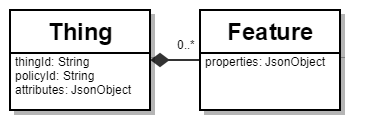

# Basic concepts overview

## Domain model

Eclipse Ditto does not claim to know exactly which structure Things in the 
IoT have or should have.<br/>
Its idea is to be as agnostic as possible when it comes to `Thing` data.

Nevertheless, two coarse elements are defined in order to structure `Thing`s (see also [Thing](basic-thing.html)):
* Attributes: intended for managing static metadata of a `Thing` - as JSON object - which does not change frequently.
* [Features](basic-feature.html): intended for managing state data (e.g. sensor data or configuration data) of a `Thing`.

## API version 2

In API version 2 the information which _subjects_ are allowed to READ, WRITE Things are managed separately via
[Policies](basic-policy.html).<br />
The `Thing` only contains a `policyId` which links to a Policy containing the authorization information.
This class diagram shows the structure Ditto requires for **API version 2**:


*Class diagram of Ditto's most basic entities in <b>API version 2.</b>*

### JSON Format

In **API version 2** the most minimalistic representation of a Thing is for example the following:

```json
{
  "thingId": "the.namespace:the-thing-id",
  "policyId": "the.namespace:the-policy-id"
}
```

Attributes and Features are optional (as also shown in the class diagram above), so in the example JSON above they are 
omitted.

A minimalistic Thing with one attribute, one Feature, and a definition could look like this:

```json
{
  "thingId": "the.namespace:the-thing-id",
  "policyId": "the.namespace:the-policy-id",
  "definition": "digitaltwin:DigitaltwinExample:1.0.0",
  "attributes": {
    "location": "Kitchen"
  },
  "features": {
    "transmission": {
       "properties": {
         "cur_speed": 90
       }
     }
  }
}
```
